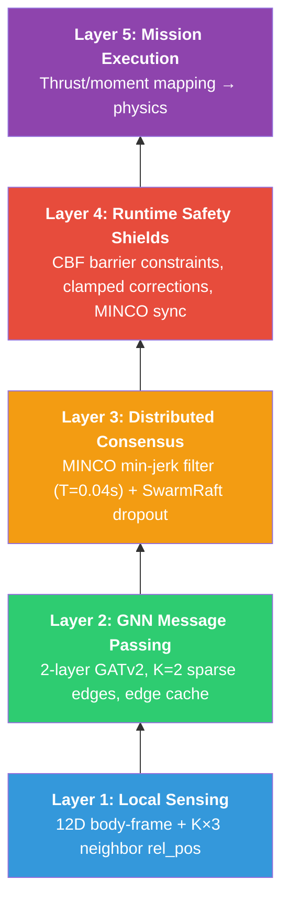

## Current Phase: GG Swarm Live (Post-Capstone)

Following the successful completion of the academic capstone, the project has transitioned into **GG Swarm Live**, a real-hardware deployment program. The focus is now on taking the decentralized GATv2/PPO policies developed in simulation and deploying them onto physical PX4-based airframes. This creates an adaptive execution layer that can handle formation stability, obstacle avoidance, and decentralized coordination for commercial drone light shows.

### Cinematic Trailer

Cut from twenty clips captured in Phase 5 of the capstone: decentralized
GATv2/PPO policies holding formation, avoiding obstacles and coordinating
in simulation.

<!-- markdownlint-disable MD033 -->

<iframe width="560" height="315" src="https://www.youtube.com/embed/toPCBIbLLLM?si=Oy1DaxqxORCvJR57" title="GG Swarm cinematic trailer" frameborder="0" allow="accelerometer; autoplay; clipboard-write; encrypted-media; gyroscope; picture-in-picture; web-share" referrerpolicy="strict-origin-when-cross-origin" allowfullscreen></iframe>

<!-- markdownlint-enable MD033 -->

### Roadmap & Development Phases

The project is currently progressing through the following hardware-focused roadmap:

    <strong>Phase 1</strong> In Progress
    &middot;
    8 Development Milestones
    &middot;
    Hardware Deployment Track

    

        

            Phase 0
            Complete
        

        <h4 class="phase-title">Capstone Baseline</h4>
        
v1.0.0-capstone simulation baseline in Isaac Lab.

    

    

        

            Phase 1 &middot; Active Target
            Active
        

        <h4 class="phase-title">Shared-Scene Training</h4>
        
Multi-drone training in complex shared simulation scenes.

    

    

        

            Phase 2
            Planned
        

        <h4 class="phase-title">Sim-to-Real Baseline</h4>
        
Initial deployment to Crazyflie drones with LPS.

    

    

        

            Phase 3
            Planned
        

        <h4 class="phase-title">Decentralized Assignment</h4>
        
Transitioning to peer-to-peer ranging and consensus logic.

    

    

        

            Phase 4
            Planned
        

        <h4 class="phase-title">Drone Show Capability</h4>
        
Integration with <strong>Skybrush</strong> for expressive shapes and light shows.

    

    

        

            Phase 5
            Planned
        

        <h4 class="phase-title">Outdoor Deployment</h4>
        
Extended fault tolerance and RTK-GPS integration.

    

    

        

            Phase 6
            Planned
        

        <h4 class="phase-title">Onboard Compute</h4>
        
Moving all inference and obstacle avoidance to onboard chips.

    

    

        

            Phase 7
            Stretch
        

        <h4 class="phase-title">Hardware-Agnostic</h4>
        
General-purpose adaptive swarm execution layer.

    

---

## Archived Milestone: Academic Capstone (v1.0.0)

This section preserves the original research and simulation work completed for my Computer Science Capstone at CSUMB.

### Project Overview

The capstone addressed a critical bottleneck in the deployment of unmanned aerial vehicle swarms by tackling the inherent vulnerabilities found in centralized control architectures. The project proposed a fully decentralized coordination framework where global formation behavior emerges naturally from local agent interactions.

### Technical Architecture

The architecture was split into the **Brain** (GATv2 spatial reasoning) and the **Muscles** (MINCO trajectory optimization), unified by a GNSC 5-Layer model.

#### GNSC 5-Layer Architecture

### Capstone Timeline & Simulation Performance

The simulation phase leveraged **NVIDIA Isaac Lab** for GPU-accelerated physics, achieving high-fidelity results in formation stability and obstacle avoidance.

* **Mean Formation Error**: < 0.1m during steady flight.
* **Success Rate**: > 95% across randomized obstacle-dense environments.

#### Capstone Timeline

* **Weeks 1–4**: Proposal and Plan (Completed)
* **Weeks 5–11**: Core Development (Brain/Muscles) (Completed)
* **Weeks 12–15**: Stress Testing and Showcase Prep (Completed)
* **Week 16**: Capstone Festival Delivery (Completed April 2026)
