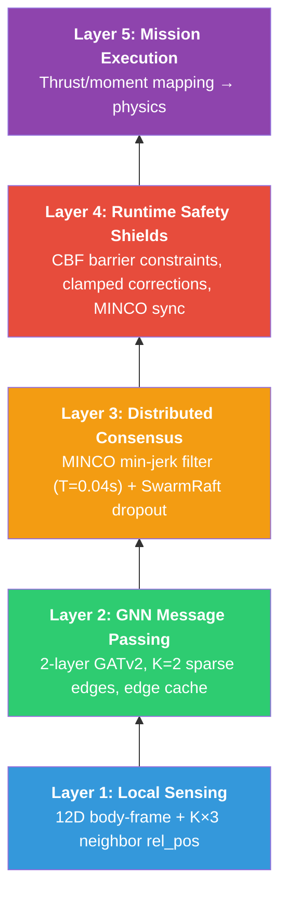
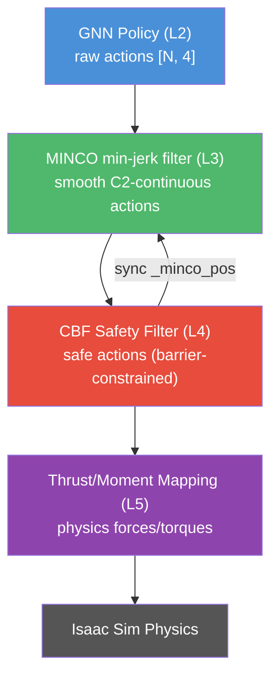

## Project Overview

This capstone project addresses a critical bottleneck in the deployment of unmanned aerial vehicle swarms by tackling the inherent vulnerabilities found in centralized control architectures. Traditional hub and spoke models often suffer from single points of failure and prohibitive communication latencies as swarm sizes scale, making them a liability for high-stakes applications in disaster response, reconnaissance, and agriculture.

To solve this, the project proposes a fully decentralized coordination framework where global formation behavior emerges naturally from local agent interactions. By combining **Graph Neural Networks** for spatial reasoning with advanced **trajectory optimization** for flight dynamics, the system achieves a robust and fault-tolerant solution for complex aerial maneuvers.

## Technical Architecture

The technical architecture is split into two primary functional components described as the **brain** and the **muscles**:

* **The Brain**: Utilizes a Graph Attention Network to establish permutation invariance, allowing an individual drone to process information from an arbitrary number of neighbors without the need for retraining. This establishes a scalable coordination policy where drones maintain spatial awareness through local message passing.
* **The Muscles**: To translate neural network outputs into smooth flight, the project integrates **Minimum Control** trajectory optimization. This ensures that all maneuvers are dynamically feasible and significantly reduces the velocity jitter commonly found in raw reinforcement learning controllers.
* **The Heart/Nerves**: Incorporates **SwarmRaft**, a decentralized consensus logic that allows the swarm to automatically re-synchronize and fill gaps left by failing agents without human intervention.

## GNSC 5-Layer Architecture

## Action Pipeline

## Simulation & Performance

The implementation leverages **NVIDIA Isaac Lab**, utilizing GPU-accelerated physics and high-fidelity rendering. This allows agents to learn complex behaviors in parallel across thousands of simulated environments before being tested in challenging scenarios such as cluttered forests and urban canyons.

**Performance Targets:**

* **Mean Formation Error**: < 0.1m during steady flight.
* **Re-sync Latency**: Fill gaps within 2.0s of drone failure.
* **Success Rate**: > 95% across randomized obstacle-dense environments.
* **Decision Latency**: End-to-end latency under 90ms.

## Demo

<!-- markdownlint-disable MD033 -->

<iframe width="560" height="315" src="https://www.youtube.com/embed/mPHrrt0b45c?si=BKt7HmGNt-22kJGY" title="YouTube video player" frameborder="0" allow="accelerometer; autoplay; clipboard-write; encrypted-media; gyroscope; picture-in-picture; web-share" referrerpolicy="strict-origin-when-cross-origin" allowfullscreen></iframe>

<!-- markdownlint-enable MD033 -->
