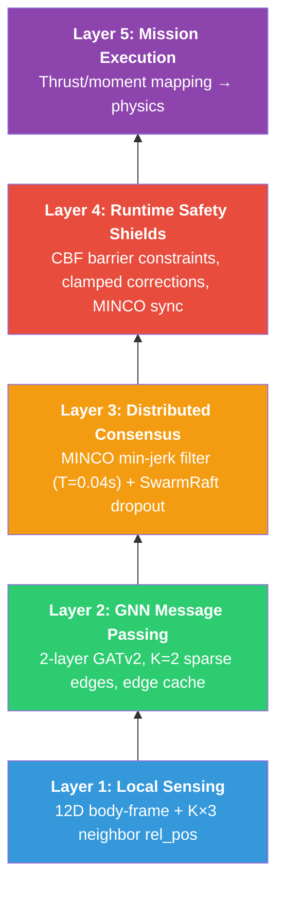

## Current Phase: Re-planned, Parked (Post-Capstone)

After the capstone I asked how real drone swarms get built. Three
independent surveys agreed: swarms that work in the field run on
predictable, checkable planning code, not end-to-end learning. So the plan
changed. A deterministic plan-and-certify core comes first. It assigns
drones to formation slots, plans the transitions and proves them safe
before anything flies. Online decentralized replanning comes next, behind
a safety filter, and the GATv2[^gatv2]/PPO[^ppo] policy from the capstone
runs behind that filter as a challenger, benchmarked against the classical
methods. Hardware goes Crazyflie indoors first, then an ArduPilot outdoor
drone. The work is parked while my ground rover comes first.

### Cinematic Trailer

Cut from twenty clips captured in Phase 5 of the capstone: decentralized
GATv2/PPO policies holding formation, avoiding obstacles and coordinating
in simulation.

<!-- markdownlint-disable MD033 -->

<iframe width="560" height="315" src="https://www.youtube.com/embed/toPCBIbLLLM?si=Oy1DaxqxORCvJR57" title="GG Swarm cinematic trailer" frameborder="0" allow="accelerometer; autoplay; clipboard-write; encrypted-media; gyroscope; picture-in-picture; web-share" referrerpolicy="strict-origin-when-cross-origin" allowfullscreen></iframe>

<!-- markdownlint-enable MD033 -->

### Roadmap & Development Phases

<!-- markdownlint-disable MD033 MD046 -->

<strong>Parked</strong>
&middot;
6 Milestones
&middot;
Plan-and-Certify First

Phase 0
Complete

<h4 class="phase-title">Capstone Baseline</h4>

v1.0.0-capstone: GATv2/PPO formation policy in Isaac Lab.

Phase 1
Complete

<h4 class="phase-title">Plan-and-Certify Core v1</h4>

Slot assignment, smooth transitions and a validator that proves separation, speed limits and geofence before flight.

Phase 2
Planned

<h4 class="phase-title">CrazySim Test</h4>

Fly certified plans in the Crazyflie simulator and compare flown against planned.

Phase 3
Planned

<h4 class="phase-title">Crazyflie Indoors</h4>

A few real Crazyflies flying certified formations.

Phase 4
Planned

<h4 class="phase-title">Decentralized Replanning</h4>

Drones react to each other live behind a safety filter; the RL policy is benchmarked head to head.

Phase 5
Stretch

<h4 class="phase-title">Outdoor Swarm</h4>

ArduPilot outdoor drones, shared with the ggSkylight show platform.

<!-- markdownlint-enable MD033 MD046 -->

---

## Archived Milestone: Academic Capstone (v1.0.0)

This section preserves the original research and simulation work completed for my Computer Science Capstone at CSUMB.

### Project Overview

The capstone addressed a critical bottleneck in the deployment of unmanned aerial vehicle swarms by tackling the inherent vulnerabilities found in centralized control architectures. The project proposed a fully decentralized coordination framework where global formation behavior emerges naturally from local agent interactions.

### Technical Architecture

The architecture was split into the **Brain** (GATv2 spatial reasoning) and the **Muscles** (MINCO[^minco] trajectory optimization), unified by a GNSC 5-Layer model.

#### GNSC 5-Layer Architecture

```mermaid
flowchart BT
    L1["<b>Layer 1: Local Sensing</b><br/>12D body-frame + K×3 neighbor rel_pos"]
    L2["<b>Layer 2: GNN Message Passing</b><br/>2-layer GATv2, K=2 sparse edges, edge cache"]
    L3["<b>Layer 3: Distributed Consensus</b><br/>MINCO min-jerk filter (T=0.04s) + SwarmRaft dropout"]
    L4["<b>Layer 4: Runtime Safety Shields</b><br/>CBF barrier constraints, clamped corrections, MINCO sync"]
    L5["<b>Layer 5: Mission Execution</b><br/>Thrust/moment mapping → physics"]

    L1 --> L2 --> L3 --> L4 --> L5

    style L1 fill:#3498db,color:#fff
    style L2 fill:#2ecc71,color:#fff
    style L3 fill:#f39c12,color:#fff
    style L4 fill:#e74c3c,color:#fff
    style L5 fill:#8e44ad,color:#fff
```

### Capstone Timeline & Simulation Performance

The simulation phase leveraged **NVIDIA Isaac Lab**[^isaaclab] for GPU-accelerated physics, achieving high-fidelity results in formation stability and obstacle avoidance.

* **Mean Formation Error**: < 0.1m during steady flight.
* **Success Rate**: > 95% across randomized obstacle-dense environments.

#### Capstone Timeline

* **Weeks 1–4**: Proposal and Plan (Completed)
* **Weeks 5–11**: Core Development (Brain/Muscles) (Completed)
* **Weeks 12–15**: Stress Testing and Showcase Prep (Completed)
* **Week 16**: Capstone Festival Delivery (Completed April 2026)

## References

[^gatv2]: Brody, Alon, Yahav (2022). "How Attentive Are Graph Attention Networks?". *International Conference on Learning Representations (ICLR)*. [arXiv:2105.14491](https://arxiv.org/abs/2105.14491)
[^ppo]: Schulman, Wolski, Dhariwal, Radford, Klimov (2017). "Proximal Policy Optimization Algorithms". [arXiv:1707.06347](https://arxiv.org/abs/1707.06347)
[^minco]: Wang, Zhou, Xu, Gao (2022). "Geometrically Constrained Trajectory Optimization for Multicopters". *IEEE Transactions on Robotics* 38(5): 3259–3278. [doi:10.1109/TRO.2022.3160022](https://doi.org/10.1109/TRO.2022.3160022)
[^isaaclab]: Mittal, Yu, Yu, Liu, et al. (2023). "Orbit: A Unified Simulation Framework for Interactive Robot Learning Environments". *IEEE Robotics and Automation Letters* 8(6): 3740–3747. The framework that became NVIDIA Isaac Lab. [doi:10.1109/LRA.2023.3270034](https://doi.org/10.1109/LRA.2023.3270034)
